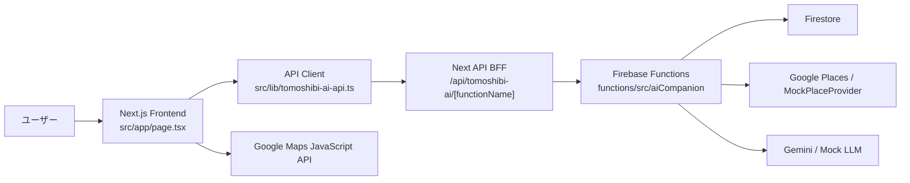

# TOMOSHIBI Master MVP 現行システム整理資料

作成日: 2026-04-29  
対象ディレクトリ: `/Users/wataru/tomoshibi/apps/tomoshibi-master-mvp`  
対象URL: `http://localhost:8082/`  
対象範囲: フロントエンド、Next BFF、Firebase Functions、Firestore、Google Maps、AIコンパニオン機能

## 1. 現在の結論

TOMOSHIBI Master MVP は、現時点で「フロントだけのモックアプリ」ではなく、`tomoshibi-master-mvp` ディレクトリ内に統合された Firebase Functions バックエンドを Next.js フロントから呼び出す、フロント/バックエンド一体型のAIコンパニオン外出支援MVPになっている。

実行時に `/Users/wataru/tomoshibi/apps/tomoshibi_ai` へ接続しているわけではない。移行元バックエンドの実装は `tomoshibi-master-mvp/functions/src/aiCompanion` に複製・統合されており、Master MVP 単体でバックエンドを持つ構成になっている。

通常のユーザー操作では、フロント内に固定で置かれた提案カード、固定初期会話、固定ランダム返信、固定アルバムを表示しない。キャラクター、関係性、外出セッション、ルート提案、会話、フィードバック、外出記録、カスタマイズはバックエンドAPIまたはバックエンドから取得したデータを起点に表示される。

ただし、バックエンド内部には開発・外部API未設定時のための mock provider がある。これは「フロントが勝手に見せるモック」ではなく、Functions がGoogle Places等の取得に失敗した場合にバックエンドレスポンスとして返す開発用フォールバックである。

## 2. システム全体像

現在の構成は次の4層で動いている。

1. フロントエンド

- `src/app/page.tsx`
- ユーザーが見る画面を構成する。
- ホーム、会話、地図、記録、設定の5タブを持つ。
- API呼び出しは `src/lib/tomoshibi-ai-api.ts` に集約されている。
- API型は `src/lib/tomoshibi-ai-types.ts` が再エクスポートしており、実体は `functions/src/aiCompanion/types/*` を正本にしている。

2. Next API route BFF

- `src/app/api/tomoshibi-ai/[functionName]/route.ts`
- フロントから `/api/tomoshibi-ai/*` として呼ばれる。
- 実際の Firebase Functions Emulator / Cloud Functions へPOSTする中継層。
- 許可された functionName だけを通す。
- `TOMOSHIBI_AI_AUTH_MODE=local` ではbodyの `userId` を使う。
- `TOMOSHIBI_AI_AUTH_MODE=firebase` では Firebase ID token を検証し、bodyの `userId` を検証済みUIDで上書きしてからFunctionsへ渡す。

3. Firebase Functions バックエンド

- `functions/src/aiCompanion`
- AIコンパニオン機能のAPI、repository、service、typesを持つ。
- Functions直叩き時にも `TOMOSHIBI_AI_AUTH_MODE=firebase` なら Firebase Admin SDK でID tokenを検証し、bodyの `userId` を検証済みUIDで上書きする。
- `local` では既存のMVP/Emulator用 `userId` を使う。

4. Firestore / 外部API

- Firestoreにキャラクター、ユーザー、関係性、セッション、メッセージ、提案、フィードバック、思い出、カスタマイズ等を保存する。
- Google Maps JavaScript API はフロントの地図表示に使う。
- Google Places API はバックエンドの周辺地点検索・詳細取得に使う想定。
- Gemini等のLLMはバックエンドのコンパニオン文生成・思い出要約に使う想定。
- 外部APIキー未設定時や検索失敗時は、バックエンド内部の mock/fallback provider が候補を返す場合がある。

## 3. ユーザー体験としてできること

ユーザーはスマホアプリ風の1画面UIで、次の体験ができる。

### 3.1 相棒キャラクターを選ぶ

ホーム上部と設定画面で、バックエンドに登録されているキャラクター一覧から相棒を選べる。

画面上では、キャラクター名、説明、関係性レベル、外出回数などが表示される。これらは固定値ではなく、`getAvailableCharacters` と `getUserCompanionState` の結果から組み立てられる。

キャラクターを切り替えると、現在のセッション、提案、会話、記録、訪問済み地点、カスタマイズエラー等の画面状態を一度クリアし、選択キャラクターに紐づく状態を再取得する。

### 3.2 外出条件を設定する

ホームの「外出条件」で、次の条件を入力・選択できる。

- エリアモード
  - 現在地周辺
  - 壱岐
- 出発地点
  - 現在地を使う
  - 地点を指定
- 手動地点プリセット
  - 東京駅
  - 壱岐中心
  - 郷ノ浦
  - 芦辺
- 手動地点の緯度
- 手動地点の経度
- 手動地点名
- 所要時間
  - 20分
  - 30分
  - 45分
  - 60分
- 移動手段
  - 徒歩
  - 自転車
  - 車
  - 公共交通
- 興味タグ
  - カフェ
  - 静か
  - 歴史
  - 神社
  - 景色
  - 海
  - 土地の話
- 今の気分

壱岐モードを選ぶと、`areaId: "iki"` をバックエンドへ渡す。これにより、バックエンド側では壱岐用エリア設定、注釈、推奨タグを参照できる。

現在地モードではブラウザの geolocation を使う。位置情報が取得できない場合やユーザーが拒否した場合は、手動地点へ切り替えて外出開始できる。

### 3.3 現在地または指定地点から外出セッションを始める

ホームの「現在地で探す」を押すと、フロントは次の順で動く。

1. 位置情報または手動地点を `origin` として確定する。
2. `createGuideSession` を呼ぶ。
3. バックエンドが `GuideSession` を作成する。
4. バックエンドがセッション開始メッセージを `guideSessionMessages` に保存する。
5. フロントが `sessionId` を保持する。
6. 続けて `suggestGuideRoute` を呼ぶ。
7. バックエンドが周辺地点検索、ルート生成、相棒コメント生成を行う。
8. フロントが会話画面へ遷移する。
9. 会話画面にセッション開始メッセージ、相棒の提案文、提案カードが表示される。

この流れにより、ユーザー体験としては「条件を入れて、相棒に今日の外出候補を出してもらう」状態になる。

### 3.4 相棒AIと会話する

会話タブでは、相棒に自由入力メッセージを送れる。

ユーザーがメッセージを送ると、フロントは `respondToCompanion` を呼ぶ。バックエンドでは、ユーザーメッセージを `guideSessionMessages` に保存し、直近メッセージ、ユーザー、キャラクター、関係性、セッション、必要に応じた地点情報を使って相棒の返答を生成する。返答も `guideSessionMessages` に保存され、フロントに表示される。

API失敗時は固定ランダム返信ではなく、エラーメッセージを会話内に表示する。

### 3.5 提案カードを見る

外出提案は `RoutePlan` をフロント側で `SuggestionData` に変換して表示する。

提案カードでは、次のような情報が表示される。

- ルートタイトル
- 代表地点名
- 地域ラベル
- 相棒コメント
- 推薦理由
- 所要時間
- 距離
- 評価
- カテゴリ
- ストーリー/説明
- タグ

提案カードをタップすると詳細モーダルが開き、そこから地図へ移動できる。

### 3.6 提案に対して操作する

会話内の提案や相棒メッセージにはアクションボタンが付く。

現在の整理では、UI操作は2種類に分かれる。

会話生成が必要な操作:

- `tell_more`
- `change_mood`
- `next_suggestion`

これらは `respondToCompanion` に送られ、相棒の追加返答が生成される。

記録だけでよい操作:

- `save_place`
- `save_route`
- `visited`
- `arrived`
- `liked`
- `not_interested`
- `skip_place`
- `start_route`

これらは `saveUserFeedback` に送られ、バックエンドにフィードバックイベントとして保存される。保存後、フロントは「保存しました」「行った記録を残しました」などの確認メッセージを会話に追加する。

`visited` の場合は、フロントの `visitedPlaceIds` にも地点IDが追加され、外出完了時の訪問地点候補になる。

`start_route` の場合は、フィードバック保存後に地図タブへ移動する。

### 3.7 地図で現在地と提案地点を見る

地図タブでは、Google Maps JavaScript API を使って地図を表示する。

地図画面の状態は次の通り。

- `NEXT_PUBLIC_GOOGLE_MAPS_API_KEY` がない場合
  - API key未設定の案内を表示する。
- Google Maps読み込み中
  - 読み込み中UIを表示する。
- 読み込み失敗
  - 地図を表示できないエラーを表示する。
- 読み込み成功
  - 地図を表示する。
  - ブラウザの現在地取得を試みる。
  - 現在地が取れた場合、現在地ピンを表示する。
  - `routes` がある場合、`RoutePlan.places[].place` をピン表示する。
  - 地図の下部シートに「現在地」「n件の提案」「現在地を中心に表示しています」などを表示する。

地図はフロント内固定地点ではなく、現在地とバックエンドから返ったルート地点を元に描画される。

### 3.8 外出を完了して思い出にする

会話画面の「今日のおしまい」を押すと、フロントは `completeJourney` を呼ぶ。

渡す訪問地点は次の優先順位で決まる。

1. ユーザーが「行った」操作をした地点ID
2. それがなければ、現在のルート候補の先頭地点をフォールバックとして利用

バックエンドでは、セッション、会話履歴、フィードバックイベント、訪問地点を集め、`JourneyMemoryService` により外出記録を作成する。作成された記録は `journeyMemories` に保存される。さらに関係性データも更新され、セッションは `completed` になる。

完了後、フロントは `listJourneyMemories` で記録を再取得し、記録タブへ移動する。

### 3.9 記録を見る

記録タブでは、バックエンドに保存された `JourneyMemory` 一覧を表示する。

表示される内容:

- 外出回数
- 相棒状態
- 関係性レベル
- 累計外出回数
- 累計訪問地点数
- 記録タイトル
- 作成日
- 記録サマリー
- 相棒からのメッセージ
- 訪問地点
- 学習された好み

記録がない場合は、固定アルバムを出すのではなく、空状態として「外出を完了すると表示される」旨を出す。

### 3.10 相棒の見た目を設定する

設定タブでは、キャラクター選択とカスタマイズ保存ができる。

バックエンドから `getCharacterCustomization` を呼び、次を取得する。

- 現在のユーザー別カスタマイズ
- 利用可能パーツ一覧
- デフォルト外見

画面では、カテゴリごとにパーツを選択できる。

カテゴリ:

- 顔
- 目
- 眉
- 口
- 髪
- 服
- アクセサリ
- 色

「見た目を保存」を押すと `updateCharacterCustomization` を呼ぶ。バックエンドは選択されたパーツIDが存在するか検証し、ユーザー×キャラクター単位のカスタマイズを保存する。

## 4. フロント画面別の現状

## 4.1 ホーム画面

ホーム画面は、アプリの開始地点である。

主な役割:

- キャラクター状態の表示
- キャラクター切り替え
- 関係性レベル/外出回数の表示
- 外出条件の入力
- セッション開始
- 最新提案の表示
- 最近の思い出の表示

使用する状態:

- `characters`
- `selectedCharacterId`
- `selectedCharacter`
- `relationship`
- `journeys`
- `routes`
- `companionGuide`
- `guidePreferences`
- `integrationStatus`
- `integrationError`

使用するAPI:

- `getAvailableCharacters`
- `getUserCompanionState`
- `getActiveGuideSession`
- `listGuideSessionMessages`
- `listJourneyMemories`
- `getCharacterCustomization`
- `createGuideSession`
- `suggestGuideRoute`

バックエンド連動:

- 初期表示でキャラクター一覧を取得する。
- キャラクター選択時に関係性、記録、カスタマイズ、アクティブセッションを取得する。
- 「現在地で探す」でセッション作成とルート提案取得を実行する。
- 提案が存在する場合、バックエンドの `RoutePlan` からカードを生成する。

エラー/空状態:

- キャラクター一覧取得に失敗した場合は `integrationError` を表示する。
- seedがない場合は「キャラクターがまだ登録されていません」と表示する。
- 提案がない場合は「まだ候補はありません」と表示する。
- 検索中は「現在地と相棒の状態から候補を探しています」と表示する。

## 4.2 会話画面

会話画面は、外出セッション中の相棒との対話画面である。

主な役割:

- 会話履歴表示
- 提案カード表示
- 自由入力送信
- アクションボタン実行
- 外出完了

使用する状態:

- `activeSessionId`
- `apiMessages`
- `isSendingMessage`
- `routes`
- `visitedPlaceIds`

使用するAPI:

- `respondToCompanion`
- `saveUserFeedback`
- `completeJourney`

バックエンド連動:

- 自由入力は `respondToCompanion` に送られ、ユーザーメッセージと相棒返答がバックエンドに保存される。
- 「もっと知る」などの会話系アクションは `respondToCompanion` に送られる。
- 保存/訪問/好みなどのフィードバック系アクションは `saveUserFeedback` に送られる。
- 「今日のおしまい」は `completeJourney` を呼ぶ。

エラー/空状態:

- セッション未開始なら「ホームで現在地で探すを押すと始まります」と表示する。
- セッション未開始で送信しようとした場合は、先に外出セッションを始めるよう返す。
- API失敗時は固定返答ではなくエラー文を会話内に追加する。

## 4.3 地図画面

地図画面は、現在地と提案地点の確認画面である。

主な役割:

- Google Maps表示
- 現在地取得
- 現在地ピン表示
- 提案地点ピン表示
- 提案件数表示

使用する状態:

- `routes`
- `status`
- `locationStatus`

使用する外部API:

- Google Maps JavaScript API
- Browser Geolocation API

バックエンド連動:

- 地図そのものはフロントで描画する。
- 表示する候補地点は `suggestGuideRoute` で取得した `RoutePlan.places[].place` に依存する。

エラー/空状態:

- Maps API keyがない場合は設定案内を表示する。
- 読み込み失敗時は地図表示エラーを表示する。
- 位置情報拒否時は許可が必要であることを表示する。
- ルートがない場合は現在地中心の地図として表示する。

## 4.4 記録画面

記録画面は、完了済み外出の履歴画面である。

主な役割:

- 外出記録一覧表示
- 相棒との関係性表示
- 訪問地点表示
- 学習された好み表示

使用する状態:

- `journeys`
- `relationship`
- `companionName`

使用するAPI:

- `listJourneyMemories`
- `completeJourney` 実行後の再取得

バックエンド連動:

- `listJourneyMemories` が返した `JourneyMemory[]` を表示する。
- 外出完了時は `completeJourney` が新しい `JourneyMemory` を作成し、記録画面へ反映する。

エラー/空状態:

- 記録がない場合は空状態を表示する。
- 固定のアルバムや固定実績は出さない。

## 4.5 設定画面

設定画面は、キャラクター選択と見た目カスタマイズの画面である。

主な役割:

- キャラクター切り替え
- 関係性表示
- カスタマイズ情報取得
- パーツカテゴリ別選択
- カスタマイズ保存

使用する状態:

- `characters`
- `selectedCharacterId`
- `relationship`
- `customizationState`
- `customizationStatus`
- `customizationError`

使用するAPI:

- `getCharacterCustomization`
- `updateCharacterCustomization`
- `getUserCompanionState`

バックエンド連動:

- キャラクター選択時に、そのキャラクターの状態とカスタマイズを取得する。
- 選択パーツは `updateCharacterCustomization` で保存される。
- 保存後はレスポンスの `customization` で画面状態を更新する。

エラー/空状態:

- 読み込み中は「カスタマイズ情報を取得しています」と表示する。
- エラーがあればエラー文を表示する。

## 5. API一覧と役割

フロントは `src/lib/tomoshibi-ai-api.ts` を通して、Next BFF `/api/tomoshibi-ai/*` を呼ぶ。

## 5.1 `getAvailableCharacters`

目的:

- 利用可能なキャラクター一覧を取得する。

フロント利用箇所:

- 初期表示
- ホームのキャラクター選択
- 設定画面のキャラクター選択

バックエンド処理:

- `CharacterRepository.list()` でキャラクター一覧を取得する。
- 各キャラクターの defaultAppearance を必要に応じて取得する。
- previewMessage を組み立てる。

Firestore:

- `characters`
- `characterAppearances`

## 5.2 `getUserCompanionState`

目的:

- ユーザー×キャラクターの現在状態を取得する。

フロント利用箇所:

- キャラクター選択時
- ホーム表示
- 記録/設定の関係性表示

バックエンド処理:

- Userを取得する。
- Characterを取得する。
- Relationshipを取得する。
- UserCharacterCustomizationを取得する。
- defaultAppearanceを取得する。

Firestore:

- `users`
- `characters`
- `relationships`
- `userCharacterCustomizations`
- `characterAppearances`

## 5.3 `getActiveGuideSession`

目的:

- 選択キャラクターの未完了セッションを復元する。

フロント利用箇所:

- キャラクター選択後
- ページ再読み込み後の途中復帰

バックエンド処理:

- `GuideSessionRepository.getLatestActiveByUserAndCharacter` で最新active sessionを取得する。
- `GuideSuggestionRepository.getLatestBySessionId` で直近提案を取得する。

Firestore:

- `guideSessions`
- `guideSuggestions`

## 5.4 `listGuideSessionMessages`

目的:

- セッション内の会話履歴を取得する。

フロント利用箇所:

- アクティブセッション復元時

バックエンド処理:

- セッションが存在し、ユーザーのものか確認する。
- `GuideSessionMessageRepository.listBySessionId` で履歴を取得する。

Firestore:

- `guideSessions`
- `guideSessionMessages`

## 5.5 `createGuideSession`

目的:

- 外出セッションを開始する。

フロント利用箇所:

- ホームの「現在地で探す」

入力:

- `userId`
- `characterId`
- `mode`
- `origin`
- `areaId`
- `context`
  - `availableMinutes`
  - `mobility`
  - `mood`
  - `interests`
  - `companionType`

バックエンド処理:

- 入力を検証する。
- Userを作成または取得する。
- Characterを取得またはデフォルト作成する。
- Relationshipを作成または取得する。
- Relationshipにセッション開始を反映する。
- GuideSessionを `active` で作成する。
- セッション開始メッセージを `guideSessionMessages` に保存する。
- `session_started` analytics event を保存する。

Firestore:

- `users`
- `characters`
- `relationships`
- `guideSessions`
- `guideSessionMessages`
- `analyticsEvents`

## 5.6 `suggestGuideRoute`

目的:

- セッション条件に合わせた外出ルートを提案する。

フロント利用箇所:

- `createGuideSession` 直後

バックエンド処理:

- セッションを取得し、ユーザー所有を確認する。
- User/Character/Relationshipを取得する。
- `areaId` があれば AreaMode を取得する。
- 移動手段やエリア設定から検索半径を決める。
- Google Places または mock fallback で周辺地点を取得する。
- PlaceCacheへ保存する。
- エリア注釈を取得して地点情報へマージする。
- RoutePlannerでRoutePlanを作る。
- 直近JourneyMemoryを取得する。
- CompanionGeneratorで相棒の提案コメントを作る。
- GuideSuggestionとして保存する。
- `route_suggested` analytics event を保存する。

Firestore:

- `guideSessions`
- `users`
- `characters`
- `relationships`
- `areaModes`
- `placeAnnotations`
- `placeCache`
- `guideSuggestions`
- `journeyMemories`
- `analyticsEvents`

外部API:

- Google Places API
- Gemini等のLLM

フォールバック:

- Places検索が失敗した場合、`MockPlaceProvider` でバックエンド由来の候補を返す。

## 5.7 `respondToCompanion`

目的:

- ユーザーの自由入力または会話系アクションに対して、相棒の返答を生成する。

フロント利用箇所:

- 会話入力
- 「もっと知る」
- 会話生成が必要なアクション

バックエンド処理:

- セッションを取得し、ユーザー所有を確認する。
- User/Character/Relationshipを取得する。
- 自由入力があればユーザーメッセージを保存する。
- アクションがフィードバックを伴う場合はFeedbackEventを作成し、記憶へ反映する。
- `tell_more` かつ地点IDがある場合、提案内地点またはPlaceCache/Google Placesから地点詳細を取得する。
- 直近メッセージを取得する。
- CompanionGeneratorで返答を生成する。
- 相棒メッセージを保存する。
- `companion_message_sent` analytics event を保存する。

Firestore:

- `guideSessions`
- `users`
- `characters`
- `relationships`
- `guideSessionMessages`
- `guideSuggestions`
- `placeCache`
- `feedbackEvents`
- `analyticsEvents`

外部API:

- Gemini等のLLM
- Google Places details

## 5.8 `saveUserFeedback`

目的:

- 保存、訪問、好み、スキップ、ルート選択などのユーザー行動を記録する。

フロント利用箇所:

- 保存
- 行った
- 到着
- 気に入った
- 興味なし
- スキップ
- ルート選択

バックエンド処理:

- セッションを取得し、ユーザー所有を確認する。
- FeedbackEventを作成する。
- `applyFeedbackMemory` でユーザー記憶/関係性側へ反映する。

Firestore:

- `guideSessions`
- `feedbackEvents`
- 記憶・関係性関連コレクション

## 5.9 `completeJourney`

目的:

- 外出セッションを完了し、思い出として保存する。

フロント利用箇所:

- 会話画面の「今日のおしまい」

バックエンド処理:

- セッションを取得し、ユーザー所有を確認する。
- セッション内メッセージを取得する。
- セッション内フィードバックを取得する。
- JourneyMemoryServiceで思い出を生成する。
- RelationshipServiceで関係性を更新する。
- JourneyMemoryを保存する。
- GuideSessionを `completed` に更新する。
- `journey_completed` analytics event を保存する。

Firestore:

- `guideSessions`
- `guideSessionMessages`
- `feedbackEvents`
- `journeyMemories`
- `relationships`
- `analyticsEvents`

外部API:

- Gemini等のLLM

## 5.10 `listJourneyMemories`

目的:

- ユーザー×キャラクターの外出記録一覧を取得する。

フロント利用箇所:

- ホームの最近の思い出
- 記録画面
- 外出完了後の再取得

バックエンド処理:

- `JourneyMemoryRepository.listRecentByUserAndCharacter` で記録を取得する。
- limitは最大30件。

Firestore:

- `journeyMemories`

## 5.11 `getJourneyMemory`

目的:

- 特定の外出記録詳細を取得する。

現状のフロント利用:

- APIクライアントには実装済み。
- 現在の画面本線では一覧表示が中心で、詳細専用画面はまだない。

バックエンド処理:

- JourneyMemoryをIDで取得する。
- userId/characterIdの所有確認を行う。

Firestore:

- `journeyMemories`

## 5.12 `getCharacterCustomization`

目的:

- キャラクター見た目設定に必要な情報を取得する。

フロント利用箇所:

- 設定画面
- キャラクター切り替え時

バックエンド処理:

- Characterを取得する。
- ユーザー別カスタマイズを取得する。
- なければデフォルトカスタマイズを返す。
- 利用可能パーツ一覧を取得する。
- defaultAppearanceを取得する。

Firestore:

- `characters`
- `userCharacterCustomizations`
- `characterParts`
- `characterAppearances`

## 5.13 `updateCharacterCustomization`

目的:

- ユーザー別キャラクター見た目設定を保存する。

フロント利用箇所:

- 設定画面の「見た目を保存」

バックエンド処理:

- Characterを取得する。
- 利用可能パーツ一覧を取得する。
- 選択されたpartIdが存在するか検証する。
- 既存カスタマイズがあれば引き継ぐ。
- 新しいselectedPartsとlastUpdatedAtを保存する。

Firestore:

- `characters`
- `characterParts`
- `userCharacterCustomizations`

## 5.14 `trackOutboundClick`

目的:

- 外部リンククリックを記録し、redirect URLを返す。

現状のフロント利用:

- APIとしては統合済み。
- 現在の主要UIでは外部リンククリック導線はまだ本線化されていない。

バックエンド処理:

- URL形式を検証する。
- セッション所有を確認する。
- ClickTrackingServiceでクリックを保存する。

Firestore:

- `outboundClicks`

## 6. Firestoreデータモデル

現在のAIコンパニオン領域で扱う主要データは次の通り。

## 6.1 `users`

ユーザー本体。

主なフィールド:

- `id`
- `displayName`
- `createdAt`
- `updatedAt`
- `preferenceSummary`
- `preferences`

作成/利用:

- `createGuideSession` で存在しない場合に作成される。
- `respondToCompanion` や `suggestGuideRoute` で参照される。

## 6.2 `characters`

相棒キャラクター。

主なフィールド:

- `id`
- `name`
- `description`
- `persona`
- `expressionStyle`
- `capabilities`
- `defaultAppearanceId`
- `guideStyle`
- `createdAt`
- `updatedAt`

作成/利用:

- seedで登録される。
- ない場合、`createGuideSession` がデフォルトキャラクターを作る場合がある。

## 6.3 `relationships`

ユーザー×キャラクターの関係性。

主なフィールド:

- `id`
- `userId`
- `characterId`
- `relationshipLevel`
- `totalSessions`
- `totalWalkDistanceMeters`
- `totalVisitedPlaces`
- `sharedMemorySummary`
- `unlockedPhrases`
- `lastInteractionAt`
- `createdAt`
- `updatedAt`

更新タイミング:

- セッション開始時
- 外出完了時
- フィードバック記録時

画面反映:

- ホームのLv/外出回数
- 記録画面のCOMPANION STATE
- 設定画面のRELATIONSHIP

## 6.4 `guideSessions`

外出セッション。

主なフィールド:

- `id`
- `userId`
- `characterId`
- `mode`
- `status`
  - `active`
  - `completed`
  - `abandoned`
- `origin`
- `destination`
- `areaId`
- `context`
- `createdAt`
- `updatedAt`

作成:

- `createGuideSession`

完了:

- `completeJourney`

復元:

- `getActiveGuideSession`

## 6.5 `guideSessionMessages`

会話履歴。

主なフィールド:

- `id`
- `sessionId`
- `userId`
- `characterId`
- `role`
  - `user`
  - `companion`
  - `system`
- `content`
- `actionType`
- `placeId`
- `routeId`
- `createdAt`

作成タイミング:

- セッション開始時のopening message
- ユーザー自由入力
- 相棒返答

画面反映:

- 会話タブ
- ページ再読み込み後の復元

## 6.6 `guideSuggestions`

セッションごとのルート提案。

主なフィールド:

- `id`
- `sessionId`
- `routes`
- `companion`
- `createdAt`

作成:

- `suggestGuideRoute`

画面反映:

- ホームの提案カード
- 会話内の提案カード
- 地図上の候補地点ピン
- アクティブセッション復元時の提案復元

## 6.7 `feedbackEvents`

ユーザー行動フィードバック。

主なフィールド:

- `id`
- `userId`
- `sessionId`
- `characterId`
- `placeId`
- `routeId`
- `type`
  - `liked`
  - `not_interested`
  - `saved`
  - `skipped`
  - `visited`
  - `arrived`
  - `message_sent`
  - `route_selected`
- `metadata`
- `createdAt`

作成:

- `saveUserFeedback`
- `respondToCompanion` の一部action

使われ方:

- ユーザーの好み学習
- 外出完了時の思い出生成
- 分析イベントの補助

## 6.8 `journeyMemories`

完了した外出の記録。

主なフィールド:

- `id`
- `userId`
- `characterId`
- `sessionId`
- `title`
- `summary`
- `companionMessage`
- `visitedPlaces`
- `learnedPreferences`
- `relationshipDelta`
- `createdAt`

作成:

- `completeJourney`

画面反映:

- ホームの最近の思い出
- 記録画面

## 6.9 `characterAppearances`

キャラクターの基本外見。

主なフィールド:

- `id`
- `characterId`
- `displayName`
- `baseStyle`
- `previewImageUrl`
- `parts`
- `isDefault`
- `createdAt`
- `updatedAt`

利用:

- キャラクター一覧
- カスタマイズ画面

## 6.10 `characterParts`

見た目パーツ一覧。

主なフィールド:

- `id`
- `category`
- `name`
- `assetUrl`
- `rarity`
- `areaId`
- `unlockCondition`
- `createdAt`
- `updatedAt`

利用:

- 設定画面のパーツ選択
- `updateCharacterCustomization` の検証

## 6.11 `userCharacterCustomizations`

ユーザー別の見た目設定。

主なフィールド:

- `id`
- `userId`
- `characterId`
- `appearanceName`
- `selectedParts`
- `unlockedPartIds`
- `lastUpdatedAt`
- `createdAt`

作成/更新:

- `updateCharacterCustomization`

画面反映:

- 設定画面

## 6.12 `placeCache`

Google Places等から取得した地点情報のキャッシュ。

使われ方:

- ルート提案時に検索結果を保存する。
- `tell_more` で地点詳細が必要なときに再利用する。

## 6.13 `areaModes`

壱岐など、特定エリアモードの設定。

使われ方:

- `areaId` が指定されたセッションで検索半径やfeaturedTagsを決める。

## 6.14 `placeAnnotations`

地点に対する独自注釈。

使われ方:

- 壱岐など特定エリアの地点へ、土地の話、タグ、推薦理由、パートナー情報をマージする。

## 6.15 `analyticsEvents`

分析イベント。

作成される主なイベント:

- `session_started`
- `route_suggested`
- `companion_message_sent`
- `journey_completed`

## 6.16 `outboundClicks`

外部リンククリック記録。

現状:

- バックエンドAPIはある。
- フロントの主要体験ではまだ本線化されていない。

## 7. 主要な処理フロー

## 7.1 初期表示フロー

1. ユーザーが `http://localhost:8082/` を開く。
2. フロントが `getAvailableCharacters` を呼ぶ。
3. キャラクター一覧を受け取る。
4. `NEXT_PUBLIC_TOMOSHIBI_AI_DEFAULT_CHARACTER_ID` に一致するキャラクターを選ぶ。
5. なければ先頭キャラクターを選ぶ。
6. `getUserCompanionState` を呼ぶ。
7. 関係性、キャラクター状態を表示する。
8. `getActiveGuideSession` を呼ぶ。
9. active sessionがあれば `listGuideSessionMessages` を呼び、会話履歴を復元する。
10. `listJourneyMemories` を呼び、最近の思い出を取得する。
11. `getCharacterCustomization` を呼び、設定画面用データを取得する。

## 7.2 外出開始フロー

1. ユーザーが外出条件を設定する。
2. ユーザーが「現在地で探す」を押す。
3. フロントが現在地または手動地点を確定する。
4. `createGuideSession` を呼ぶ。
5. バックエンドがUser/Character/Relationshipを整える。
6. `guideSessions` に active session を作成する。
7. `guideSessionMessages` に開始メッセージを保存する。
8. `analyticsEvents` に `session_started` を保存する。
9. フロントが `sessionId` を保持する。
10. `suggestGuideRoute` を呼ぶ。
11. バックエンドが地点検索、注釈マージ、ルート生成、相棒コメント生成を行う。
12. `guideSuggestions` に保存する。
13. `analyticsEvents` に `route_suggested` を保存する。
14. フロントが会話画面に移動し、提案を表示する。

## 7.3 会話フロー

1. ユーザーが会話入力欄にテキストを入力する。
2. フロントがユーザー発話を画面に追加する。
3. `respondToCompanion` を呼ぶ。
4. バックエンドがユーザーメッセージを保存する。
5. バックエンドが直近履歴、関係性、セッション文脈を使って相棒返答を生成する。
6. バックエンドが相棒メッセージを保存する。
7. `analyticsEvents` に `companion_message_sent` を保存する。
8. フロントが相棒返答を会話に追加する。

## 7.4 フィードバックフロー

1. ユーザーが「保存」「行った」などを押す。
2. フロントが `feedbackTypeForUiAction` で記録系操作か判定する。
3. 記録系なら `saveUserFeedback` を呼ぶ。
4. バックエンドが `feedbackEvents` に保存する。
5. バックエンドが `applyFeedbackMemory` で記憶に反映する。
6. フロントが確認メッセージを会話に追加する。
7. `visited` の場合、フロントの `visitedPlaceIds` にも保存する。

## 7.5 外出完了フロー

1. ユーザーが「今日のおしまい」を押す。
2. フロントが訪問地点IDを組み立てる。
3. `completeJourney` を呼ぶ。
4. バックエンドがセッション、メッセージ、フィードバックを取得する。
5. JourneyMemoryServiceが思い出を生成する。
6. `journeyMemories` に保存する。
7. `relationships` を更新する。
8. `guideSessions.status` を `completed` にする。
9. `analyticsEvents` に `journey_completed` を保存する。
10. フロントが `listJourneyMemories` を再取得する。
11. フロントが記録タブへ移動する。

## 7.6 ページ再読み込み/途中復帰フロー

1. フロントが選択キャラクターを決める。
2. `getActiveGuideSession` を呼ぶ。
3. active session がある場合、`sessionId` と latestSuggestion を復元する。
4. `listGuideSessionMessages` を呼ぶ。
5. persisted messages があればそれを会話に表示する。
6. latestSuggestion があれば提案カードも復元する。

## 8. 認証とユーザーIDの扱い

現在は2モードある。

## 8.1 localモード

設定:

- `TOMOSHIBI_AI_AUTH_MODE=local`

挙動:

- フロントは `NEXT_PUBLIC_TOMOSHIBI_AI_DEFAULT_USER_ID` を使う。
- デフォルトは `local-demo-user`。
- BFFもFunctionsもbodyの `userId` をそのまま使う。
- Emulator/MVP開発向け。

## 8.2 firebaseモード

設定:

- `TOMOSHIBI_AI_AUTH_MODE=firebase`

BFF経由:

- `/api/tomoshibi-ai/*` に `Authorization: Bearer <Firebase ID token>` を付ける。
- BFFが Firebase Auth REST API でID tokenを検証する。
- BFFがbodyの `userId` を検証済みUIDで上書きする。
- Functionsへ送る。

Functions直叩き:

- Functions側も `Authorization: Bearer <Firebase ID token>` を要求する。
- Firebase Admin SDKでID tokenを検証する。
- Functions側でbodyの `userId` を検証済みUIDで上書きする。

意味:

- 本番ではクライアントが任意の `userId` を送って他人のデータを触ることを防ぐ設計になっている。
- 実FirebaseプロジェクトのID tokenによる最終通し確認は運用前確認として残る。

## 9. 外部APIと環境変数

## 9.1 フロント地図

必要:

- `NEXT_PUBLIC_GOOGLE_MAPS_API_KEY`

用途:

- Google Maps JavaScript API の読み込み。
- 地図表示。
- 現在地ピンと候補地点ピンの表示。

未設定時:

- 地図画面でAPI key未設定の案内を表示する。

## 9.2 Firebase Web設定

必要:

- `NEXT_PUBLIC_FIREBASE_API_KEY`
- `NEXT_PUBLIC_FIREBASE_AUTH_DOMAIN`
- `NEXT_PUBLIC_FIREBASE_PROJECT_ID`
- `NEXT_PUBLIC_FIREBASE_APP_ID`
- 任意で storage/messaging/measurement 系

用途:

- Firebase client initialization。
- firebase auth mode でのID token検証。
- 既存Firebase関連機能。

## 9.3 Functions接続先

必要:

- `NEXT_PUBLIC_TOMOSHIBI_AI_FUNCTIONS_BASE_URL`

ローカル例:

- `http://127.0.0.1:5001/tomoshibi-950e2/asia-northeast1`

用途:

- Next BFFがFirebase Functionsへ転送する接続先。

未設定時:

- BFFは `NEXT_PUBLIC_FIREBASE_PROJECT_ID` または既定 `tomoshibi-950e2` と emulator host/port からローカルFunctions URLを組み立てる。

## 9.4 デフォルトユーザー/キャラクター

必要:

- `NEXT_PUBLIC_TOMOSHIBI_AI_DEFAULT_USER_ID`
- `NEXT_PUBLIC_TOMOSHIBI_AI_DEFAULT_CHARACTER_ID`

用途:

- localモードのユーザーID。
- 初期選択キャラクター。

## 10. モック撤去の現状

フロントから撤去済みのもの:

- 固定提案 `SUGGESTION_BEACH`
- 固定初期会話 `INITIAL_MESSAGES`
- 固定ランダム返信 `COMPANION_REPLIES`
- 固定アルバム/固定実績の通常表示
- API失敗時に本物っぽい固定データを表示する挙動

現在残っている「開発用」のもの:

- seedデータ
- バックエンド内部の `MockPlaceProvider`
- バックエンド内部の `MockLlmClient`
- local demo user
- 手動地点プリセット

これらはユーザー体験の本線を固定モック化するものではなく、開発環境や外部API未設定時にシステムを動かすためのものとして扱われる。

## 11. 現在のローカル稼働状態

確認済み:

- Frontend dev server: `http://localhost:8082`
- Functions Emulator: `http://127.0.0.1:5001`
- BFF経由 `getAvailableCharacters` 成功
- Functions直叩き `getAvailableCharacters` 成功
- ブラウザで手動地点から外出開始成功
- バックエンド由来提案表示成功
- 保存フィードバック表示成功
- Lint成功
- TypeScript成功
- Functions build成功
- 固定モック文字列検査でヒットなし

## 12. ユーザーが現時点で体験できる一連の流れ

1. アプリを開く。
2. 相棒キャラクターが表示される。
3. 外出条件を選ぶ。
4. 現在地または手動地点を指定する。
5. 「現在地で探す」を押す。
6. 相棒が外出セッションを始める。
7. バックエンドが周辺候補/ルートを提案する。
8. 会話画面で相棒の提案を見る。
9. 提案カードを開いて詳細を見る。
10. 地図タブで現在地と候補地点を見る。
11. 相棒に自由入力で質問する。
12. 「もっと知る」で候補の追加説明を聞く。
13. 「保存」「行った」などで好みや行動を記録する。
14. 「今日のおしまい」で外出を完了する。
15. 記録画面で思い出を見る。
16. 設定画面で相棒の見た目を選んで保存する。
17. 次回起動時にactive sessionや記録がバックエンドから復元される。

## 13. 実装上の重要なファイル

フロント:

- `src/app/page.tsx`
  - 5タブのUI、画面状態、主要イベントハンドラ。
- `src/lib/tomoshibi-ai-api.ts`
  - フロントのAPIクライアント。
- `src/lib/tomoshibi-ai-types.ts`
  - Functions側型の再エクスポート。
- `src/app/api/tomoshibi-ai/[functionName]/route.ts`
  - Next BFF。

バックエンド:

- `functions/src/aiCompanion/index.ts`
  - Firebase Functions HTTP endpoint定義。
- `functions/src/aiCompanion/api/*.ts`
  - 各APIのユースケース。
- `functions/src/aiCompanion/repositories/*.ts`
  - Firestoreアクセス。
- `functions/src/aiCompanion/services/companion/*`
  - 相棒文生成、プロンプト、LLM client。
- `functions/src/aiCompanion/services/places/*`
  - Places検索、正規化、キャッシュ、注釈マージ。
- `functions/src/aiCompanion/services/routing/*`
  - ルート生成、スコアリング。
- `functions/src/aiCompanion/services/memory/*`
  - 思い出生成、関係性更新、好み記憶。
- `functions/src/aiCompanion/utils/auth.ts`
  - Functions側Auth境界。
- `functions/src/aiCompanion/utils/http.ts`
  - JSON HTTP request handler。

ドキュメント:

- `docs/tomoshibi-ai-backend-frontend-merge-requirements-ja.md`
  - 統合要件・実装計画・進捗。
- `docs/tomoshibi-ai-deploy-checklist-ja.md`
  - 本番前チェックリスト。
- `docs/tomoshibi-master-mvp-current-system-ja.md`
  - この現行システム整理資料。

## 14. 現時点で「できる」と言えること

できる:

- フロントとバックエンドは同一Master MVPディレクトリ内で統合済み。
- フロントはNext BFF経由でFunctionsを呼べる。
- キャラクター一覧をバックエンドから取得できる。
- ユーザー×キャラクターの関係性を取得できる。
- 外出セッションを作成できる。
- 現在地または手動地点からルート提案を取得できる。
- 壱岐モードとして `areaId: "iki"` を渡せる。
- 会話メッセージをバックエンドへ保存し、相棒返答を取得できる。
- 保存/訪問/好み/スキップ/ルート選択をフィードバックとして保存できる。
- 外出を完了し、JourneyMemoryを作れる。
- 記録一覧をバックエンドから表示できる。
- アクティブセッションと会話履歴を復元できる。
- キャラクター見た目カスタマイズを取得・保存できる。
- Google Mapsで現在地と提案地点を表示できる。
- local/firebaseのAuthモードを切り替えられる。
- BFFとFunctions直叩きの両方でfirebase mode時のUID上書きに対応している。

## 15. 現時点の制約

制約:

- 本番Firebaseの実ID tokenを使った通し確認は、運用前確認として別途必要。
- Google Places / Gemini などの本番APIキー、利用制限、課金上限は運用前に設定確認が必要。
- フロントはまだ `src/app/page.tsx` に多くのUIと状態管理が集約されている。機能的には動くが、長期開発ではコンポーネント分割余地がある。
- JourneyMemory詳細専用画面はまだない。APIはあるが、現在のUIは一覧中心。
- `trackOutboundClick` APIはあるが、外部リンク導線は主要UIとしてはまだ本線化されていない。
- 予約、決済、購入、通知、長期記憶編集、管理者向けスポット編集は現在のAIコンパニオン本線には含まれていない。
- バックエンド内部のmock fallbackは残っているため、外部API未設定でも提案が返る場合がある。本番で完全に実データのみへ寄せる場合は環境設定とfallback方針の整理が必要。

## 16. 現在の完成状態の評価

実装計画上は100%完了している。

ここでの100%は、次の意味である。

- 移行元バックエンドをMaster MVP内へ統合した。
- フロントの主要画面がバックエンドAPI駆動になった。
- 通常表示の固定フロントモックを撤去した。
- セッション、提案、会話、フィードバック、記録、カスタマイズが一通り繋がった。
- local開発でBFF経由/Functions直叩きのスモークが通った。
- Auth境界もlocal/firebase切替可能な形まで入った。
- 本番前チェックリストが作成済み。

一方で、プロダクト運用としての100%とは別に、deploy後の本番環境確認、実ID token確認、外部APIキーの制限確認、利用量/課金確認、UI分割・保守性改善は次フェーズの作業として残る。

