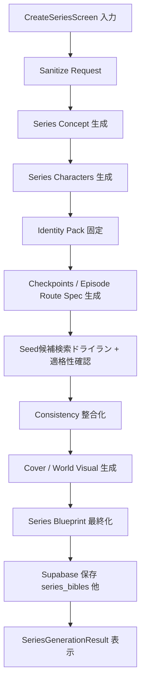
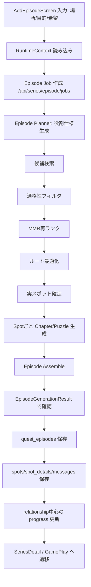

# シリーズ生成/エピソード生成フロー詳細仕様（Mastra中心）

## 1. この仕様の位置づけ
- 目的: 基準文書（`灯火（TOMOSHIBI）共通認識`）の意図を、そのままMastra実装に落とす。
- 優先順位:
1. 意図したシリーズ/エピソードが安定生成されること
2. 継続性と愛着形成が崩れないこと
3. その後に無料枠/課金枠を上乗せすること

このため、無料3話制限は「生成本体の後段ポリシー」として扱い、生成ロジック本体とは分離する。

---

## 2. 基準文書から導く非交渉要件（生成契約）

### 2-1. シリーズ生成で必須
1. シリーズ世界観がある（単発案内ではない）。
2. 固定キャラクターが継続登場前提で設計される。
3. シーズン目標と結末方向がある。
4. チェックポイントで「続きたくなる導線」がある。
5. 第1話seedは「歩ける導線」を持つが、最初から具体スポット名を決めすぎない。

### 2-2. エピソード生成で必須
1. 場所/目的はエピソード側で反映される。
2. 世界観/継続性はシリーズ側から継承される。
3. 固定キャラの継続性 + エピソード固有の新規性を両立する。
4. 前話までの状態を引き継ぐ。
5. 次話へ進むフックを残す。

### 2-3. Plannerの責務分離（重要）
- Plannerが決める: 「どんな場所が必要か（役割仕様）」まで。
- Retrieval/Routingが決める: 「実際にどの地点を使うか」。

Plannerの出力単位:
- `spot_role`
- `scene_role`
- `required_attributes`
- `visit_constraints`
- `tourism_value_type`

---

## 3. シリーズ生成フロー（詳細）

現行の中心実装:
- `mastra/src/workflows/series-workflow.ts`
- `src/services/seriesAi.ts` (`generateSeriesDraftViaMastra`)
- `src/services/quests.ts` (`saveSeriesBlueprint`)

### 3-1. フロー全体

### 3-2. 各ステップ仕様

#### Step S1: 入力正規化（sanitize-series-request）
- 入力: interview回答、任意prompt、希望話数。
- 目的: 空文字・形式崩れを除去し、生成に使える固定フォーマットにする。
- 実装: `sanitizeRequestStep`。
- 成功条件:
1. `desired_episode_count` が範囲内。
2. interview5項目が空でない。

#### Step S2: シリーズ概念生成（generate-series-concept）
- 出力: `title, overview, premise, season_goal, world, ai_rule_points`。
- 実装: `generateSeriesConcept`。
- 成功条件:
1. タイトル/前提/目標が非空。
2. 世界観主要要素（setting, core_conflict）が非空。

#### Step S3: 固定キャラクター生成（generate-series-characters）
- 出力: 固定キャラ集合。
- 実装: `generateSeriesCharacters`。
- 成功条件:
1. 主要固定キャラ（`tier=primary`）1〜2人を必須。
2. 準固定（`tier=secondary`）は最大2〜3人。
3. `must_appear=true` は primary のみに原則付与。
4. `name/role/personality/arc` 欠落なし。

#### Step S4: 同一性固定（build-series-identity-pack）
- 出力: `identity_pack`, `key_person_character_ids`, `identity_anchor_tokens`。
- 実装: `buildSeriesIdentityPack`, `syncIdentityPackWithCharacters`。
- 成功条件:
1. key personが1〜3人。
2. 各キャラの同一性アンカーが埋まる。

#### Step S5: 継続設計（generate-series-checkpoints）
- 出力: `checkpoints(4〜8)`, `first_episode_route_spec`。
- 注意: ここで具体スポット名は固定しない。
- `first_episode_route_spec` の例:
1. `scene_role=起, spot_role=導入公共空間, tourism_value_type=地域導入`
2. `scene_role=承, spot_role=関係進展拠点, tourism_value_type=文化体験`
3. `scene_role=転/結, spot_role=余韻地点, tourism_value_type=景観`
- 成功条件:
1. checkpoints連番。
2. `carry_over` が次話接続を持つ。
3. route specが2〜4スポット分存在。

#### Step S6: Seed候補検索ドライラン + 適格性確認
- 目的: route specが実地で成立するかを事前検証。
- 処理:
1. 候補検索
2. 適格性フィルタ（公共アクセス/徒歩導線/移動負荷/地域説明可能性）
3. MMRで重複削減
4. 軽量ルーティングで成立性判定
- 成功条件:
1. route specごとに候補が確保できる。
2. 2〜4スポットの徒歩導線が成立。

#### Step S7: 一貫性統合（finalize-series-blueprint 内）
- 出力: `continuity`, refined overview, ai rules。
- 実装: `generateSeriesConsistency`。
- 成功条件:
1. invariant rulesが最低3。
2. episode link policyが最低3。
3. 街歩き制約が残る。

#### Step S8: ビジュアル統合
- 出力: cover + world visual assets。
- 実装: `buildCoverWithConsistency`, portrait uniqueness checks。

#### Step S9: 永続化（saveSeriesBlueprint）
- 保存先:
1. `series_bibles`
2. `series_characters`
3. `series_episode_blueprints`（具体地名ではなく仕様保存を許容）
- 成功条件:
1. 3テーブル保存成功。
2. `progress_state` 初期化済み。
3. `first_episode_route_spec` 保存済み。

---

## 4. エピソード生成フロー（詳細）

現行の中心実装:
- `mastra/src/lib/agents/seriesRuntimeEpisodeAgent.ts`
- `src/screens/AddEpisodeScreen.tsx`
- `src/screens/EpisodeGenerationResultScreen.tsx`
- `src/services/quests.ts` (`applySeriesProgressPatch`, `saveRuntimeEpisodeSpots`)

### 4-1. フロー全体

### 4-2. 各ステップ仕様

#### Step E1: ランタイム文脈取得
- 実装: `fetchSeriesEpisodeRuntimeContext`。
- 取得内容:
1. `series_bibles`（overview, premise, season_goal, ai_rules, continuity, progress_state）
2. `series_characters`（`tier`, `must_appear` 含む）
3. `series_episode_blueprints`（checkpoint用途）
4. `recent_episodes`

#### Step E2: Episode job起動
- 実装: `POST /api/series/episode/jobs`。
- サーバ検証:
1. request schema
2. primaryキャラ存在

#### Step E3: Planner（役割仕様生成）
- 実装: `generateEpisodePlan`（改修）。
- 出力:
1. 今回タイトル（第N話）
2. 5〜7件の `spot_requirements`（`spot_role`, `scene_role`, `required_attributes`, `visit_constraints`, `tourism_value_type`）
3. completion_condition / carry_over_hook
- 注意: ここでは具体スポット名を確定しない。

#### Step E4: 候補検索（retrieval）
- 入力: `spot_requirements` + `stage_location`。
- 出力: requirementごとの候補集合。

#### Step E5: 適格性フィルタ（eligibility）
- 目的: 「文章として成立」ではなく「現地で成立」を担保。
- 判定軸:
1. 公共アクセス可能性
2. 徒歩導線成立性
3. 同エピソード内移動負荷
4. 地域性の説明可能性
5. 観光目的との接続可能性
6. 世界観との矛盾許容範囲

#### Step E6: MMR再ランク
- 目的: 類似候補の偏りを減らし、多様で意味のある5〜7地点を選ぶ。

#### Step E7: ルート最適化
- 目的: 時間・徒歩制約下で実行可能な巡回順を選ぶ。
- 方針: OR-Tools等を想定（TSP/VRP/時間窓）。

#### Step E8: 実スポット確定
- 出力: `resolved_spots`（実名・座標・訪問順）。
- ここで初めて `spot_name` を確定する。

#### Step E9: Spot本文生成
- 実装: `generateSpotsContent` -> `generateChapter`（puzzle LLM生成は停止）。
- 入力: `resolved_spots`。

#### Step E10: Assemble -> 保存
- 実装: `assembleEpisode` -> `createEpisodeForSeries` -> `saveRuntimeEpisodeSpots`。

#### Step E11: 継続状態更新（relationship中心）
- 実装: `applySeriesProgressPatch`（改修）。
- 更新対象（真の状態）:
1. `relationship_state_summary`
2. `relationship_flags`（例: `became_more_open`, `shared_secret`, `still_keeping_distance`）
3. `recent_relation_shift`
4. `unresolved_threads`, `revealed_facts`, `next_hook`
- 補助指標:
- `companion_trust_level` はUI/分析用の派生値として計算（真の単一状態にしない）。

---

## 5. 品質ゲート（改訂版）

### 5-1. 構造ゲート
シリーズ:
1. primaryキャラ1〜2人必須。
2. checkpoints >= 4。
3. route specが2〜4件。

エピソード:
1. resolved spotsが5〜7。
2. 全spotに `mission + question + answer`。
3. primaryキャラ登場必須（must_appear遵守）。
4. `carry_over_hook` と `next_hook` が非空。

### 5-2. 現実適格性ゲート（追加必須）
1. 公共アクセス可能性。
2. 徒歩導線成立性。
3. 同エピソード内の移動負荷上限。
4. 地域性の説明可能性。
5. 観光目的との接続可能性。
6. 世界観との矛盾が強すぎないこと。

### 5-3. 関係性ゲート
1. 関係性更新が `flags + summary + shift` で説明可能。
2. 前話と矛盾する急変は理由付きでのみ許可。

### 5-4. 失敗時動作
1. ステップ単位で最大2回再試行。
2. 失敗理由をjob eventとtraceに残す。
3. 最終失敗時はフォールバック出力へ切替。

---

## 6. 必要なデータモデル変更（実装前提）

### 6-1. `series_characters`
追加:
- `tier TEXT CHECK (tier IN ('primary','secondary'))`
- `must_appear BOOLEAN DEFAULT false`

運用:
- primaryのみ `must_appear=true` を原則。

### 6-2. `series_bibles.progress_state`
推奨キー:
- `relationship_state_summary: string`
- `relationship_flags: string[]`
- `recent_relation_shift: string[]`
- `unresolved_threads: string[]`
- `revealed_facts: string[]`
- `next_hook: string`

互換:
- `companion_trust_level` は残してもよいが「派生値」扱い。

### 6-3. 生成トレース
- `episode_generation_traces` に `eligibility_reject_reasons`, `mmr_scores`, `route_metrics` を保存。

---

## 7. 実装順（無料枠より前）

### Phase A: Planner責務分離
1. S5/E3を「役割仕様出力」に改修。
2. spot_name確定をE8へ移動。

### Phase B: 現実適格性フィルタ
1. eligibility filter実装。
2. 失格理由のtrace保存。

### Phase C: キャラクター階層化
1. `tier/must_appear` をDB・生成・表示に反映。
2. primary中心の会話密度ルールを実装。

### Phase D: relationship中心progress
1. progress reducerを数値中心からflags中心へ移行。
2. trustは派生値へ変更。

### Phase E: 無料枠/課金枠（後段）
1. `max_episode_no` 制御。
2. 無料3話完結（導入/展開/収束）。
3. 有料延長で次シーズンを解放。

---

## 8. まず着手する具体タスク（次スプリント）
1. `seriesRuntimeEpisodeAgent` のplanner出力を `spot_requirements` 化。
2. retrieval -> eligibility -> MMR -> routing の前段パイプラインを追加。
3. `series_characters` に `tier/must_appear` migration追加。
4. `progress_state` を relationship中心キーへ移行する reducer実装。
5. 品質ゲートに現実適格性ゲートを追加。

この5件を先に実装すれば、無料枠前でも「意図した生成」と「現地成立性」を両方判定できる状態になる。
