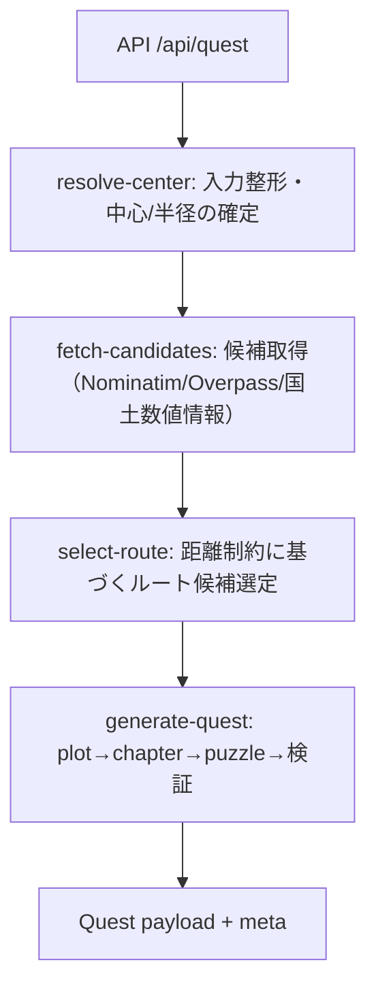

# Mastra Workflow

このファイルは `scripts/update-workflow.mjs` により自動生成されます。直接編集しないでください。

## Diagram



## ASCII Diagram

```
[API /api/quest] -> [resolve-center] -> [fetch-candidates] -> [select-route] -> [generate-quest] -> [Quest payload + meta]
```

## Steps

| # | Step Variable | Step ID | Note |
| --- | --- | --- | --- |
| 1 | resolveCenterStep | resolve-center | 入力整形・中心/半径の確定 |
| 2 | fetchCandidatesStep | fetch-candidates | 候補取得（Nominatim/Overpass/国土数値情報） |
| 3 | selectRouteStep | select-route | 距離制約に基づくルート候補選定 |
| 4 | generateQuestStep | generate-quest | plot→chapter→puzzle→検証 |
